# Guia de bolso de SVG
## [*Por Joni Trythall*](httpw://jonibologna.com/)
### Tradução por [*Willian Justen*](http://github.com/willianjusten) e [*Lucas Maia*](http://github.com/lucasmaiaesilva)
#### [Compre a versão PDF aqui](http://svgpocketguide.com/) (Versão em inglês)

## Muito Obrigado!

Eu gostaria de dedicar essa sessão inteira para deixar um especial "Muito obrigado!" para:

* [CSS-Tricks](http://css-tricks.com/)
* [Lincoln Loop](http://lincolnloop.com/)
* [Designmodo](http://designmodo.com/)
* [Tahoe Partners](http://tahoepartners.com/Pages/Tahoe%20Partners.aspx)

Fico bastante agradecida pelo suporte a este livro e espero realmente não ter ofendido nenhum de vocês por não utilizar sua fruta favorita.	

## Table of Contents
* Introduction
	* Before You Begin
		* Using SVG
		* Vector Graphic Software
		* Inline SVG
		* SVG User Accessibility
		* General Notes
* Section 1: Document Organization
	* Organization & Semantics
		* svg Element
		* g Element
		* use Element
		* defs Element
		* symbol Element
	* Stacking Order
* Section 2: Basic Shapes & Paths
	* Basic Shapes
		* Rectangle
		* Circle
		* Ellipse
		* Line
		* Polyline
		* Polygon
	* The path Element
		* path data
			* moveto
			* closepath
			* lineto
				* L, l
				* H, h
				* V, v
			* Curve Commands
				* Cubic Bézier
				* Quadratic Bézier
				* Elliptical Arc
	* Embeds From Vector Software
* Section 3: Workspace
	* viewport
	* viewBox
		* preserveAspectRatio
	* Coordinate System Transforms
		* translate
		* rotate
		* scale
		* skew
* Section 4: Fills & Strokes
	 * fill Properties
	 	* fill
	 	* fill-rule
	 	* fill-opacity
	 * stroke Attributes
	 	* stroke
	 	* stroke-width
	 	* stroke-linecap
	 	* stroke-linejoin
	 		* stroke-miterlimit
	 	* stroke-dasharray
	 	* stroke-dashoffset
	 	* stroke-opacity
* Section 5: The text Element
	* Basic Attributes
		* x, y, dx, dy
		* rotate
		* textLength & lengthAdjust
	* The tspan Element
	* Spacing Properties
		* kerning & letter-spacing
		* word-spacing
	* text-decoration
	* text Along a Path
		* textPath Element
		* xlink:href
		* startOffset
* Section 6: Advanced Features
	* Gradients
		* Linear Gradients
			* stop Nodes
			* x1, y1, x2, y2
			* gradientUnits
			* spreadMethod
			* gradientTransform
			* xlink:href
		* Radial Gradients
		* cx, cy, r
		* fx, fy
	* Patterns
		* Basic Attributes
			* x, y, width, height
			* patternUnits
			* patternContentUnits
		* Nested Patterns
	* Clipping Path
* Conclusion

## Introdução

Scalable Vector Graphics (SVG) é uma linguagem para descrever gráficos bidimensionais baseada no padrão XML. Esses gráficos consistem em caminhos, imagens e/ou textos capazes de serem escalados e redimensionados sem perder a qualidade de imagem.

Em resumo SVG refere-se a códigos escritos e incorporados juntamente com o HTML para gerar esses gráficos no browser, o qual inclusive, será o foco deste livro.

Existem muitas vantagens em usar o SVG dessa maneira, incluindo ter acesso a partes individuais do gráfico para propósitos de interatividade, gerando textos pesquisáveis, acesso ao DOM para edições diretas, e promovendo a acessibilidade ao usuário.

Começando com a organização básica e formas simples, nós vamos então continuar a descrever o sistema de coordenadas do SVG ou "canvas", pintando o interior do gráfico e/ou sua borda, transformando-o, e usando a "manipulação gráfica" do texto. Só então vamos acrescentá-lo com toques e técnicas mais avançadas como gradientes e padrões.

Esse guia tem o propósito de fornecer uma rápida porém consistente introdução para se construir SVG *inline*, e ao mesmo tempo, de forma alguma, abrange todos os recursos disponíveis, portanto, deve ser útil no processo de inicialização de Designers e Desenvolvedores que desejam adicionar o SVG em seu *workflow* de maneira mais acessível possível.

A partir de pequenos detalhes para começar a escrever seu próprio código, este guia pretende ser uma referência para escrever SVG.

### Antes de você começar

Enquanto esse "Guia de bolso" é destinado para aqueles que já sabem uma coisa ou duas sobre HTML e CSS, existem algumas coisas adicionais que serão úteis em saber antes de aprofundar no código SVG em seu *browser* favorito, tais como: A informação necessária dentro do fragmento SVG para a renderização adequada, como fazer seus gráficos tão acessíveis quanto possível, e também saber como e quando usar software geradores de vetores gráficos.

#### Usando SVG

Existem [algumas maneiras diferenças de incluir o SVG](http://css-tricks.com/using-svg/) em seus projetos: *inline*, com a tag ``, como *background-image*, como `<object>`, ou como *Data URI's*. Estaremos, de maneira específica, abordando o uso do SVG *inline* que envolve a escrita de código SVG diretamente dentro do corpo de um documento HTML devidamente estruturado.

Por enquanto só abordaremos SVG inline aqui, mas vale ressaltar que podem haver casos em que um outro método pode ser mais apropriado. Por exemplo, quando você não pretende editar propriedades diretamente no próprio gráfico ou acessar partes individuais do mesmo, usá-lo com um `` talvez seja melhor adequado ao seu projeto.

#### Sofwares de Vetor Gráfico

Softwares de vetor gráfico são opções quando você está procurando criar gráficos mais complexos que não fariam sentido escrevê-los a mão. Sotwares como [Adobe Illustrator](http://www.adobe.com/products/illustrator.html), [Inkscape](http://www.inkscape.org/en/), [Sketch](http://bohemiancoding.com/sketch/), [iDraw](http://www.indeeo.com/idraw/), ou [WebCode](http://www.webcodeapp.com/) podem ser ferramentas úteis para o seu SVG.

A vantagem destes tipos de ferramentas é que você pode exportar seu código SVG e incorporá-lo diretamente em seu HTML. Vamos tocar nesse assunto um pouco adiante.

#### *Inline* SVG na Web

Por razões de brevidade ao longo do livro, o DOCTYPE SVG, número da versão assim como xmlns e xml:space foram excluídos de todas os exemplos de código.

Esses atributos especificam ao *browser* a [versão do SVG](http://www.w3.org/TR/xml11/) sendo usado no momento assim como o [*namespace*](http://www.w3.org/TR/REC-xml-names/) do documento. A principal coisa a lembrar neste momento é que você geralmente não precisa incluir esses atrtibutos para renderizar com sucesso o seu gráfico no navegador.

Vamos dar uma olhada nestes atributos agora, em um exemplo de código SVG gerado pelo Illustrator, para garantir que isso não irá deixá-lo surpreso quando começar:

	<!DOCTYPE svg PUBLIC "-//W3C//DTD SVG 1.1//EN" "http://www.w3.org/Graphics/SVG/1.1/DTD/svg11.dtd">
	<svg version="1.1" xmlns="http://www.w3.org/2000/svg" xmlns:xlink="http://www.w3.org/1999/xlink" xml:space="preserve">
	</svg>

Na maioria dos casos o DOCTYPE e seus atributos dentro do elemento `<svg>` não são essenciais para que seu gráfico seja renderizados e podem ser descartados, com o objetivo de "limpar" seu código.

#### SVG - Acessibilidade do Usuário

Utilizando recursos [Acessibilidade SVG](http://www.sitepoint.com/tips-accessible-svg/) é um ótimo hábito a se formar, mas novamente por questão de simplicidade, descrições e títulos não serão incluídos no código no decorrer deste livro.

Uma vez que você se torne mais experiente ao escrever o SVG, a inclusão desses elementos irá tornar seus gráficos mais acessíveis aos usuários. Por exemplo, o conteúdo dentro do elemento `<desc>` permite o fornecimento de uma descrição detalhada de gráficos para usuários com *screen readers*.

O texto em SVG também possui uma enorme vantagem sobre imagens baseadas em *raster* tradicionais em termos de acessibilidade. Isto porque o texto em SVG pode ser detectado e lido pelo *browser*, e pode facilmente ser redimensionado para acomodar as preferências específicas de leitura.

#### Notas Gerais

Um pouco mais de notas gerais antes de você mergulhar no livro: As fontes usadas ao longo deste livro estão disponíveis em [Google Fonts](https://www.google.com/fonts). Enquanto isso você terá acesso explicitado através do `font-family` aqui, o que você não verá e terá que incluir em seu documento, é o `link` ou o `@import` obtido através do Google Fonts.

Os exemplos, utilizam-se de *pixels* e porcentagem, como unidades de medida. Os tamanhos que suportam o SVG como unidades de medida são: em, ex, px, pt, pc, cm, mm, in, e porcentagens.

Os códigos SVG neste livro podem ser adicionados em qualquer editor de texto e então visualizados em [qualquer *browser* que suporte *inline* SVG](http://caniuse.com/svg-html5). Enquanto o suporte dos *browsers* é muito presente para o SVG no geral, este suporte pode se tornar muito menos consistente com técnicas mais avançadas como gradientes, por exemplo. [*Can I Use*](http://caniuse.com/) é um ótimo lugar para checar o suporte do seu *browser* para esses tipos de recursos, mas em última, nada que você vai aprender encontra-se em versão de teste.

Além disso tudo, você pode também copiar o código como está, colar dentro da sessão do HTML dentro do [CodePen](http://codepen.io/), e pode ver instantâneamente o seu gráfico na tela. Não posso dizer tudo que essa ferramenta pode fornecer, já que estava interessada no SVG em primeiro lugar. É o meu jeito favorito de aprender: brincando, raciocinando e algumas vezes falhando miseravelmente.

Finalmente, alguns exemplos irão conter porções de gráficos com códigos comentados a fim de minimizar o tamanho do bloco de código quando aquela porção particular não é essencial para a explicação do tópico em si.

	<svg>
		<!--<path d=<this path is commented out> />-->
	</svg>

## Seção 1. Organização do documento

Os detalhes do SVG residem dentro do elemento `<svg>`. Este elemento contém alguns atributos que permitem a custumização do seu gráfico no *"canvas"*. Enquanto esses atributos não são completamente necessários para renderizar uma imagem, não utilizá-los também pode deixar gráficos mais complexos vulneráveis a não renderizar corretamente em todos os browsers.

Como mencionado, gráficos *inline* podem ser escritos "na mão", ou incorporados acessando o código XML gerado pelos softwares gráficos. De qualquer forma, uma organização e estrutura adequedas são cruciais para uma escrita eficiente do SVG, principalmente porque a ordem dos elementos gráficos determinam sua ordem no *stack* (similar ao z-index de css).

### Organização e Semântica

Um fragmento de documento de SVG é feito de vários elementos contidos dentro do elemento `<svg>`. A organização desse documento é crucial. O conteúdo deste documento pode aumentar rapidamente, e uma organização adequada promove acessibilidade e eficiência, beneficiando ambos, o autor e seus usuários.

Esta seção irá introduzir a chave para escrever SVG - o elemento `<svg>`- e revisar alguns atributos comuns que irão auxiliar num documento inicial.

#### O elemento svg

O elemento `<svg>`é classificado tanto como um *container* quanto como um elemento estrutural, e pode ser usado para criar um fragmento SVG independente dentro do documento. Este fragmento tendo seu próprio sistema de coordenadas.

Os atributos usados neste elemento, como `width`, `height`, `preserveAspectRatio`e `viewBox`definem o espaço onde o gráfico será escrito.

Ao obter o código SVG de algum software de vetor ele terá [várias informações](http://www.w3.org/TR/SVG/struct.html#SVGElement) dentro do elemento `<svg>`, como a versão do SVG (indica a versão da linguagem SVG que está sendo utilizada) e o DOCTYPE. Como mencionado anteriormente, essa informação não será incluída no decorrer deste guia, e sua exclusão não irá prejudicar a renderização do gráfico em sua tela.

#### O elemento g

O `g` é um elemento de *container* que serve para agrupar elementos gráficos relacionados. Utilizando este elemento junto com os elementos de descrição e título podemos fornecer informações sobre o gráfico, ajudando assim, a organização e acessibilidade através do agrupamento desses componentes.

Além disso, ao agrupar elementos relacionados, você pode manipular o grupo como um todo contra as partes individuais. Isto é especialmente útil quando se quer animar estes elementos, por exemplo, a animação pode ser aplicada ao grupo.

Qualquer elemento que não está contido em um `g` é considerado como seu próprio grupo.

#### use Element

The `<use>` element allows you to reuse elements throughout a document. There are additional attributes that can be included within this element, such as `x`, `y`, `width`, and `height`, which define the mapping location details of the graphic within the coordinate system.

Using the `xlink:href` attribute here enables you to call on the element to be reused. For example, if there was a `<g>` with an `id` of “apple” containing the image of an apple that needed to be reused this image can be referenced by `<use>`: `<use x="50" y="50" xlink:href="#apple" />`.

This element can be a significant time saver and help minimize required code.

#### defs Element

While `<use>` permits the reuse of a graphic already rendered, graphics within a `<defs>` element are not rendered onto the canvas, but are able to be referenced and then rendered through the use of `xlink:href`.

Graphics are defined within `<defs>` and can then be used throughout the document by referencing the `id` of that graphic.

For example, the following code draws a very simple gradient within a rectangle:

		<svg>
    		<defs>
      			<linearGradient id="Gradient-1">
        			<stop offset="0%" stop-color="#bbc42a" />
        			<stop offset="100%" stop-color="#765373" />
      			</linearGradient>
    		</defs>
    		<rect x="10" y="10" width="200" height="100" fill= "url(#Gradient-1)" stroke="#333333" stroke-width="3px" />
  		</svg>

The contents of the `<defs>` has no visual output until called on by referencing its unique `id`, which in this instance is being done through the `fill` attribute of the rectangle.

#### symbol Element

The `<symbol>` element is similar to `<g>` as it provides a way to group elements, however,  elements within `<symbol>` have no visual output (like `<defs>`) until called on with the `<use>` element.

Also unlike the `<g>` element, `<symbol>` establishes its own coordinate system separate from the viewport it's rendered in.

SVG viewport and `viewBox`, which establish the coordinate system for the graphics being mapped, will be addressed further in a different section.

### Stacking Order

The stacking order of SVG cannot be manipulated by `z-index` in CSS as other elements within HTML can. The order in which SVG elements are stacked depends entirely on their placement within the document fragment.

The grapes and watermelon below are within the same `<svg>` element. The watermelon appears in front of the grapes because the group containing the paths that make up the watermelon is listed after the grapes in the document.

	<svg>
		<g class="grapes">
			<!--<path <stem path> />-->
			<!--<path <grapes path> />-->
			<!--<path <leaf path> />-->
		</g>
		<g class="watermelon">
			<!--<path <outside path> />-->
			<!--<path <inside path> />-->
			<!--<path <seeds path> />-->
		</g>
	</svg>

If the group containing the grapes was moved to the end of the document it would then appear in front of the watermelon.

	<svg>
		<g class="watermelon">
			<!--<path <outside path> />-->
			<!--<path <inside path> />-->
			<!--<path <seeds path> />-->
		</g>
		<g class="grapes">
			<!--<path <stem path> />-->
			<!--<path <grapes path> />-->
			<!--<path <leaf path> />-->
		</g>
	</svg>

This method of determining stacking order also applies to the individual elements within the group. For example, moving the path of the stem in the grapes image to the end of the group will result in the stem being on top.

## Seção 2. Formas e Paths básicos

As formas (*Shapes*) básicas em SVG podem ser escritos "na mão" em HTML, mas você pode eventualmente passar pela experiência de precisar usar gráficos inline muito mais complexos. Estes gráficos mais complexos podem ser gerados por softwares de vetores, mas por enquanto vamos nos atentar ao básico, que pode facilmente ser escrito "na mão".

### Formas básicas

O SVG possui os seguintes elementos que compõe as formas básicas: retângulos, circulos, elipses, linhas simples, polyline e polígonos. Cada elemento requer uma lista de atributos antes de serem renderizados, tais como coordenadas e detalhes de tamanho.

#### Retângulo 

O elemento `<rect>` é usado para definir o retângulo.

		<svg>
  			<rect width="200" height="100" fill="#BBC42A" />
		</svg>

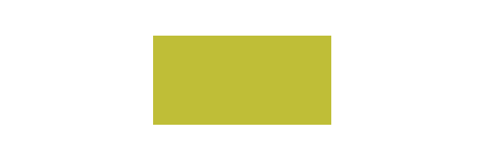

Os atributos `width` e `height` estabelecem o tamanho do retângulo, enquanto `fill` define o preenchimento interior para a forma. Os valores numéricos padrão são em *pixiels* e o `fill` deverá permanecer na cor preta quando deixado sem especificação.

Outros atributos que podem ser incluídos são as coordenadas `x` e `y`. Esses valores irão mover a forma apropriadamente de acordo com as dimensões setadas ao longo do documento `<svg>`.

Também é possível criar cantos arredondados espeificando valores com os atributos `rx` e `ry`. Por exemplo, `rx="5" ry="10"` vão renderizar uma forma com os cantos horizontais com 5px de *radius*, e verticais com 10px de *radius*.

#### Circulo

O elemento `<circle>` é mapeado com base em um ponto central e pelo tamanho de seu raio.

		<svg>
  			<circle cx="75" cy="75" r="75" fill="#ED6E46" />
		</svg>

As coordenadas `cx` e `cy`estabelecem a localização do centro do circulo em relação as dimensões configuradas no seu *workplace* pelo elemento `<svg>`.

O atributo `r` define o tamanho do raio do circulo. 

#### Elipse

O elemento `<ellipse>` define uma elipse na qual seu mapeamento basea-se em um ponto central porém com dois raios.

		<svg>
  			<ellipse cx="100" cy="100" rx="100" ry="50" fill="#7AA20D" />
		</svg>

Enquanto os valores `cx` e `cy` estabelecem um ponto central baseado na distância das coordenadas de espaço dentro do `<svg>`, os valores de `rx` e `ry` definem os raios horizontais e verticais da forma.

#### Linha Simples

O elemento `<line>` define uma linha simples com um ponto inicial e um ponto final.

		<svg>
  			<line x1="5" y1="5" x2="100" y2="100" stroke="#765373" stroke-width="8"/>
		</svg>

Juntos, os valores `x1` e `y1` estabelecem as coordenadas para o ponto de inicio da linha, enquanto os valores de `x2` e `y2` estabelecem o ponto final da linha.

#### Polyline

O elemento `<polyline>` é usado para definir um conjunto de linhas simples interligadas que, geralmente, resultam em um formato aberto (os pontos de início e fim não são conectados).

		<svg>
  			<polyline points="0,40 40,40 40,80 80,80 80,120 120,120 120,160" fill="white" 			stroke="#BBC42A" stroke-width="6" />
		</svg>

Os valores dentro do atributo `points` estabelecem ao formato a localização de `x` e `y` distribuídos através do elemento `<polyline>` e são agrupados como `x,y` distribuido por uma lista de valores.

Qualquer número diferente de entradas aqui, retornará erro.

#### Polígono 

O elemento `<polygon>` é usado para definir uma forma fechada, que consistem em linhas conectadas.

		<svg>
  			<polygon points="50,5 100,5 125,30 125,80 100,105 50,105 25,80 25,30" 					fill="#ED6E46" />
		</svg>

Os pontos do polígono são definidos através de uma série de oito grupos de valores `x,y`.

Este elemento pode também, produzir outros tipos de formatos fechados dependendo do número de pontos definidos.

### O Elemento *Path* 

Os *paths* em SVG representam a linhas externas a forma. Essa forma pode ser preenchida, contornado, usado para navegação com texto, e/ou usado como *clipping path*.

Dependendo do *shape* este *path* pode se tornar muito complexo, especialmente quando existem muitas [curvas](http://www.w3.org/TR/SVG/paths.html#PathDataCurveCommands) envolvidas. Com um conhecimento básico de como funciona, a sintaxe envolvida, enfim, esses processos vão tornar esses *paths* muito mais gerenciáveis.

#### dados do path

Os dados do *path* possuem o atributo `d` dentro do elemento `<path>`, definindo a borda externa do formato: `<path d="<dados específicos do path>" />`.

Estes dados são incluídos no atributo `d` acompanhado de instruções sobre o *path* tais como *moveto*, *line*, *curve*, *arc* e *closepath*. 

O elemento `<path>` abaixo contém as coordenadas específicas para renderização de um limão:

	<svg width="258px" height="184px">
  		<path fill="#7AA20D" stroke="#7AA20D" stroke-width="9" stroke-linejoin="round" d="M248.761,92c0,9.801-7.93,17.731-17.71,17.731c-0.319,0-0.617,0-0.935-0.021c-10.035,37.291-51.174,65.206-100.414,65.206 c-49.261,0-90.443-27.979-100.435-65.334c-0.765,0.106-1.531,0.149-2.317,0.149c-9.78,0-17.71-7.93-17.71-17.731 c0-9.78,7.93-17.71,17.71-17.71c0.787,0,1.552,0.042,2.317,0.149C39.238,37.084,80.419,9.083,129.702,9.083	c49.24,0,90.379,27.937,100.414,65.228h0.021c0.298-0.021,0.617-0.021,0.914-0.021C240.831,74.29,248.761,82.22,248.761,92z" />
	</svg>

##### moveto

The moveto commands (M or m) establish a new point, as lifting a pen and starting to draw in a new location on paper would. The line of code comprising the path data must begin with a moveto command, as shown in the above example of the lime.

moveto commands that follow the initial one represent the start of a new subpath, creating a compound path. An uppercase M here indicates absolute coordinates will follow, while a lowercase m indicates relative coordinates.

##### closepath

The closepath (Z or z) ends the current subpath and results in a straight line being drawn from that point to the initial point of the path.

If the closepath is followed immediately by a moveto, these moveto coordinates represent the start of the next subpath. If this same closepath is followed by anything other than moveto, the next subpath begins at the same point as the current subpath.

Both an uppercase or lowercase z here have identical outcomes.

##### lineto

The lineto commands draw straight lines from the current point to a new point.

###### L, l

The L and l commands draw a line from the current point to the next provided point coordinates. This new point then becomes the current point, and so on.

An uppercase L signals that absolute positioning will follow, while a lowercase l is relative.

###### H, h

The H and h commands draw a horizontal line from the current point.

An uppercase H signals that absolute positioning will follow, while a lowercase h is relative.

###### V, v

The V and v commands draw a vertical line from the current point.

An uppercase V signals that absolute positioning will follow, while a lowercase v is relative.

##### Curve Commands

There are three groups of commands that draw curved paths: Cubic Bézier (C, c, S, s), Quadratic Bézier (Q, q, T, t), and Elliptical arc (A, a).

The following curve sections will introduce the basic concept behind each curve command, review the mapping details, and then provide a diagram for further understanding.

###### Cubic Bézier

The C and c Cubic Bézier commands draw a curve from the current point using (x1,y1) parameters as a control point at the beginning of the curve and (x2,y2) as the control point at the end, defining the shape details of the curve.

The S and s commands also draw a Cubic Bézier curve, but in this instance there is an assumption that the first control point is a *reflection* of the second control point.

The following code draws a basic Cubic Bézier curve:

	<svg>
  		<path fill="none" stroke="#333333" stroke-width="3" d="M10,55 C15,5 100,5 100,55" />
	</svg>

Manipulating the first and last sets of values for this curve will impact its start and end location, while manipulating the two center values will impact the shape and positioning of the curve itself at the beginning and end.

The S and s commands also draw a Cubic Bézier curve, but in this instance there is an assumption that the first control point is a *reflection* of the last control point for the previous C command. This reflection is relative to the start point of the S command.

An uppercase C signals that absolute positioning will follow, while a lowercase c is relative. This same logic applies to S and s.

###### Quadratic Bézier

Quadratic Bézier curves (Q, q, T, t) are similar to Cubic Bézier curves except that they only have one control point.

The following code draws a basic Quadratic Bézier curve:

	<svg>
  		<path fill="none" stroke="#333333" stroke-width="3" d="M20,50 Q40,5 100,50" />
	</svg>

Manipulating the first and last sets of values, `M20,50` and `100,50`, impacts the positioning of the beginning and end points of the curve. The center set of values, `Q40,5`, define the control point for the curve, establishing its shape.

Q and q draw the curve from the initial point to the end point using (x1,y1) as the control. T and t draw the curve from the initial point to the end point by assuming that the control point is a reflection of the control on the *previously* listed command relative to the start point of the new T or t command.

An uppercase Q signals that absolute positioning will follow, while a lowercase q is relative. This same logic applies to T and t.

###### Elliptical Arc

An Elliptical Arc (A, a) defines a segment of an ellipse. These segments are created through the A or a commands which create the arc by specifying the start point, end point, x and y radii, rotation, and direction.

Here is a look at the code for a basic Elliptical Arc:

	<svg>
  		<path fill="none" stroke="#333333" stroke-width="3" d="M65,10 a50,25 0 1,0 50,25" />
	</svg>

The first and last sets of values within this path, `M65,10` and `50,25` represent initial and final coordinates, while the second set of values define the two radii. The values of `1,0` (large-arc-flag and sweep-flag) determine how the arc is drawn, as there are four different options here.

The following diagram shows the four arc options and the impact that large-arc-flag and sweep-flag values have on the final rendering of the arc segment.

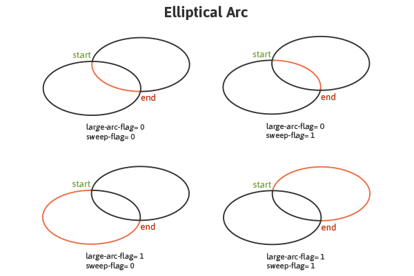

### Embeds From Vector Software

Vector graphics software allows for the generation of more complex shapes and paths while producing SVG code that can be taken, used, and manipulated elsewhere.

Once the graphic is complete, the generated XML code, which can be quite lengthy depending on the complexity, can be copied and embedded into HTML. Breaking down each section of the SVG and having the right organizational elements in place can greatly help in navigating and understanding these seemingly complex and wordy documents.

Here is the SVG code for an image of some cherries with added classes for enhanced navigation:

		<svg width="215px" height="274px" viewBox="0 0 215 274">
			<g>
				<path class="stems" fill="none" stroke="#7AA20D" stroke-width="8" stroke-linecap="round" stroke-linejoin="round" d="M54.817,169.848c0,0,77.943-73.477,82.528-104.043c4.585-30.566,46.364,91.186,27.512,121.498" />
				<path class="leaf" fill="#7AA20D" stroke="#7AA20D" stroke-width="4" stroke-linecap="round" stroke-linejoin="round" d="M134.747,62.926c-1.342-6.078,0.404-12.924,5.762-19.681c11.179-14.098,23.582-17.539,40.795-17.846 c0.007,0,22.115-0.396,26.714-20.031c-2.859,12.205-5.58,24.168-9.774,36.045c-6.817,19.301-22.399,48.527-47.631,38.028 C141.823,75.784,136.277,69.855,134.747,62.926z" />
			</g>
			<g>
				<path class="r-cherry" fill="#ED6E46" stroke="#ED6E46" stroke-width="12" d="M164.836,193.136 c1.754-0.12,3.609-0.485,5.649-1.148c8.512-2.768,21.185-6.985,28.181,3.152c15.076,21.845,5.764,55.876-18.387,66.523 c-27.61,12.172-58.962-16.947-56.383-45.005c1.266-13.779,8.163-35.95,26.136-27.478	C155.46,191.738,159.715,193.485,164.836,193.136z" />
				<path class="l-cherry" fill="#ED6E46" stroke="#ED6E46" stroke-width="12" d="M55.99,176.859 c1.736,0.273,3.626,0.328,5.763,0.135c8.914-0.809,22.207-2.108,26.778,9.329c9.851,24.647-6.784,55.761-32.696,60.78 c-29.623,5.739-53.728-29.614-44.985-56.399c4.294-13.154,15.94-33.241,31.584-20.99C47.158,173.415,50.919,176.062,55.99,176.859z" />
			</g>
		</svg>

The attributes within the `svg` element define the workspace, or “canvas” for the graphic. The leaf and the stems are within one `<g>` (group), while the cherries are in another. The string of numerical values define the path the graphic will take and the `fill` and `stroke` attributes set the color for the backgrounds and borders.

Once this code is copied it can be run through an SVG optimizer before being placed in HTML, which will help eliminate unnecessary code and spacing and in turn greatly reduce the file size. [Peter Collingridge's SVG Optimiser](http://petercollingridge.appspot.com/svg_optimiser) or [SVGO](https://github.com/svg/svgo) are tools that are very helpful in this regard.

## Seção 3. Workspace

Talvez o aspecto mais importante do SVG, depois de entender sua estrutura geral e como criar formas básicas é aprender sobre o *workspace* em uso, em outras palavras, entender o sistema de coordenadas no qual os gráficos vão ser mapeados. 

Entender o *workspace* do SVG é útil para saber como renderizar propriamente seu gráfico, porém se torna crucial entender técnicas mais avançadas em SVG. Por exemplo, o mapeamento de gradientes são fortemente estabelecidos pelo sistema de coordenadas do SVG. Este *workspce* é definido por dimensões dos atributos *viewport* e `viewbox`.  

Esta pêra, felizmente possui o *viewport* e `viewBox` que correspondem um com o outro:

		<svg width="115" height="190" viewBox="0 0 115 190">
    		<!--<path <path que desenha a pêra> />-->
  		</svg>

A pêra é inteiramente visível no *browser* e vai possuir escala adaptável quando as dimensões do *viewport* são alterados.

### viewport

O *viewport* é a parte visiível do seu SVG. Enquanto SVG pode ter a largura ou a altura que você definir, limitar o *viewport* pode significar que somente uma certa parte da imagem será vista de cada vez.

O *viewport* é configurado através dos atributos `width` e `height` dentro de `<svg>`.

Se estes valores não forem definidos, as dimensões do *viewport* irão geralmente ser determinados por outros indicadores dentro do SVG, como o `width` de um elemento externo. Entretando, a não configuração desse elemento deixa o seu *artwork* suscetível a ser cortado.

### viewBox

O `viewBox` permite a visualização de uma parte específica de uma parte de um elemento. Esses valores incluem quatro números separados por "commas" ou espaços: `min-x`, `min-y`, `width` e `height` esses parâmetros geralmente, são os mesmos setados non *viewport*.

Os valores `min` representam em qual ponto dentro da imagem o `viewBox` deve iniciar, enquanto o `width` e `height` estabelecem o tamanho do box. 

Se nós optarmos por não definir o `viewBox` a imagem não será escalada e irá corresponder a configuração feita no *viewport*.

Se 50px forem tirados de `width` e `height` do `viewBox`, a porção da imagem da pêra que está visível é reduzida, porém a parte que ainda pode ser visualizada se encaixa nas definições do *viewport*.

		<svg width="115px" height="190px" viewBox="0 0 65 140">
			<!--<path <path que desenha a pêra> />--> 
		</svg> 

Os valores de `min` dentro do `viewBox` definem o início do `viewBox` dentro de seu elemento pai. Em outras palavras, os pontos dentro do `viewBox` são as coordenadas no qual iremos criar o campo de visualização. No desenho da pêra acima os valores de `min` eram 0,0 (topo, esquerda). Vamos mudar esses valores para 50, 30: `viewBox="50 30 115 190"`.

		<svg width="115" height="190" viewBox="50 30 115 190">
			<!--<path <path que desenha a pêra> />-->
		</svg>

O `viewBox` agora começa com 50px de parâmetro `x` e 30px no parâmetro `y`. Alterando esses parâmtros a parte da pêra que está em foco é mudada.

#### preserveAspectRatio

Se o *viewport* e `viewBox` não possuirem as mesmas dimensões de `width` e `height`, o atributo `preserveAspectRatio`  direciona o browser em como efetuar o display da imagem.

O atributo `preserveAspectRatio` requer dois parâmetros, `<align>` e `<meetOrSlice>`. O primeiro parâmetro possui duas partes que direciona o alinhamento do `viewBox` dentro do *viewport*. O segundo é opcional e indica como o aspecto da dimensão será preservado.

`preserveAspectRatio="xMaxYMax meet"`

Estes valores vão alinhar o canto direito inferior do `viewBox` ao canto direito inferior do *viewport*. O `meet` preserva o aspecto da dimensão da escala do `viewBox` para se encaixar como o *viewport* o máximo possível.

Existem três opções de `<meetOrSlice>`: `meet` (padrão), `slice`, e `none`. Enquanto o `meet` se encarrega de preoduzir uma visibilidade completa do gráfico (o máximo possível), a função do `slice` é preencher o *viewport* com o `viewBox` e então cortar qualquer outra parte da imagem que não estiver dentro do *viewport* despois desta escala. `none` resulta na não preservação da dimensão e uma provável distorção da imagem. 

Talvez o valor mais inapropriado aqui é o *none*, no qual estabelece uma escala uniforme que talvez não deveria ser aplicada. Se aumentarmos os valores em pixiels do *viewport*, a imagem abaixo das cerejas vai se tornar não uniforme e ficará distorcida.

		<svg width="500" height="400" viewBox="0 0 250 600" preserveAspectRatio="none">
			<!--<path <path que desenha a cereja> />-->
		</svg>

Já o `preserveAspectRatio` da imagem abaixo está configurado para `xMinYMax meet` no qual está alinhado ao canto inferior esquerdo do *viewport*. O `meet` se certifica que a imagem está escalada para se encaixar dentro do *viewport* da melhor maneira possível.

		<svg width="350" height="150" viewBox="0 0 300 300" preserveAspectRatio="xMinYMax meet" style="border: 1px solid #333333;">
			<!--<path <path que desenha a cereja> />-->
		</svg>

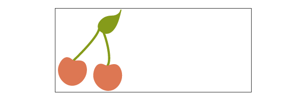

Aqui nós temos as mesmas cerejas quando `meet` é mudado para `slice`:

		<svg width="350" height="150" viewBox="0 0 300 300" preserveAspectRatio="xMinYMax slice" style="border: 1px solid #333333;">
			<!--<path <path que desenha a cereja> />-->
		</svg>

Perceba que os valores de alinhamento não precisam ser corrigidos.

		<svg width="350" height="150" viewBox="0 0 300 300" preserveAspectRatio="xMinYMid slice" style="border: 1px solid #333333;">
			<!--<path <path que desenha a cereja> />-->
		</svg>

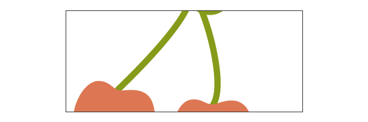

O exemplo mostrado tem o `preserveAspectRatio` de `xMinYMid slice`; as cerejas agora estão alinhadas pelo meio do parâmtro `y` do *viewport*.

### Sistema de transformação de coordenadas

O SVG dispõe de alterações adicionais no gráfico como rotação, escala, movimento, aceitando inclusive o uso de *transforms*. As transformações do SVG podem se aplicar desde elementos individuais até um grupo interiro de elementos.

Essas funções são incluidas dentro do elemento a ser manipulado e residem dentro do atributo `<transform>`. Multiplos *transforms* podem ser incluidos em diversas funções dentro deste atributo, por exemplo: `transform="translate(<tx>,<ty>) rotate(<rotation angle>)" />`.

Something important to keep in mind when transforming SVG is that it will impact your coordinate system, or workspace. This is because [transforms create a new user space](http://www.w3.org/TR/SVG/coords.html#EstablishingANewUserSpace) by essentially copying the original and then placing the transformation on the new system itself.

The following image demonstrates the coordinate system transform that takes place when placing a translation of (100,100) on the group containing the graphic:

The coordinate system itself has been translated and the image of the lime and lemon has maintained its original positioning within this system. The new user coordinate system has its origin at location (100,100) in the original coordinate system.

Because of this relationship with the coordinate system, many of these functions will move the graphic even if you are not directly setting a translation on it. For example, attempting to triple an image’s size by including a `scale` value of "3" is multiplying the `x` and `y` coordinates by "3" and the image is scaling along with it, moving it across the screen in the process.

In the case of nested transforms the effects are cumulative, so the final transform on a child element will be based on the accumulation of the transforms before it.

#### translate

The `translate` function specifies the details of moving a shape, and the two numerical values included here direct movement along both the `x` and `y` axis: `transform="translate(<tx>,<ty>)"`. These values can be separated by either whitespace or commas.

The `y` value here is optional and if omitted a value of "0" is assumed.

#### rotate

A value within `rotate` will specify the shape's rotation at its point of origin (in degrees), which for SVG is 0,0 (top left): `transform="rotate(<rotation angle>)"`.

There is also an option here to include `x` and `y` values: `transform=rotate(<rotation angle> [<cx>,<cy>])`. If supplied, these values establish a new center of rotation other than what is defaulted to (which is 0,0).

Here is an apple before and after having a 20 degree rotation applied: `transform="rotate(20)"`.
*Note that this image does not reflect the coordinate change this transform makes.*

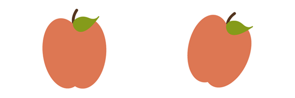

#### scale

Scaling allows the resizing of SVG elements through the use of the `scale` function. This function accepts one or two values which specify horizontal and vertical scaling amounts along the appropriate axis: `transform="scale(<sx> [<sy>])"`.

The `sy` value is optional and if omitted it is assumed to be equal to `sx` to ensure consistent resizing.

A `scale` value of ".5" would render a graphic half the size it was originally, while a value of "3" would triple this initial size. A value of "4,2" would scale a graphic four times its original width, and two times its original height.

#### skew

SVG elements can be skewed, or made crooked, through the use of the `skewX` and `skewY` functions. The value included within these functions represents a skew transformation in degrees along the appropriate axis.

Here is a look at an apple before and after adding a `skewX` value of "20": `transform="skewX(20)"`. *Note that this image does not reflect the coordinate change this transform makes.*

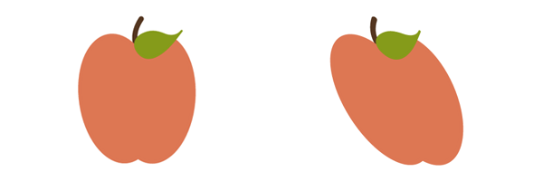

## Section 4. Fills and Strokes

`fill` and `stroke` allow us to paint to the interior and border of SVG.

"[Paint](http://www.w3.org/TR/SVG/painting.html#Introduction)" refers to the action of applying colors, gradients, or patterns to graphics through `fill` and/or `stroke`.

### fill Properties

The `fill` attribute paints the interior of a specific graphical element. This fill can consist of a solid color, gradient, or pattern.

The interior of a shape is determined by examining all subpaths and specifications spelled out within the `fill-rule`.

When filling a shape or path, `fill` will paint open paths as if the last point of the path connected with the first, even though a `stroke` color on this section of the path would not render.

#### fill-rule

The `fill-rule` property indicates the algorithm to be used in determining which parts of the canvas are included inside the shape. This is not always straightforward when working with more complex intersecting or enclosed paths.

The accepted values here are `nonzero`, `evenodd`, `inherit`.

##### nonzero

A value of `nonzero` determines the inside of a point on the canvas by drawing a line from the area in question through the entire shape in any direction and then considering the locations where a segment of the shape crosses this line. This starts with zero and adds one each time a path segment crosses the line from left to right and subtracts one each time a path segment crosses the line from right to left.

If the result is zero after evaluating and counting these intersections then the point is outside the path, otherwise it is inside.

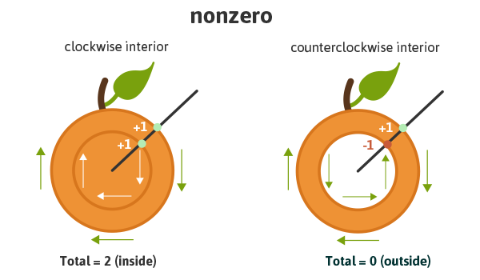

Essentially, if the interior path is drawn clockwise it will be considered as "inside", but if drawn counter-clockwise it will be considered "outside" and therefore be excluded from painting.

##### evenodd

A value of `evenodd` determines the inside of an area on the canvas by drawing a line from that area through the entire shape in any direction and counts the path segments that the line crosses. If this results in an odd number the point is inside, if even the point is outside.

Given the specific algorithm of the `evenodd` rule, the drawing direction of the interior shape in question is irrelevant, unlike with `nonzero`, as we are simply counting the paths as they cross the line.

While this property is not generally necessary, it will allow for greater `fill` control of a complex graphic, as mentioned.

##### inherit

A value of `inherit` will direct the element to take on the `fill-rule` specified by its parent.

#### fill-opacity

The `fill-opacity` value refers to the opacity level of the interior paint fill. A value of "0" results in complete transparency, "1" applies no transparency, and values in between represent a percentage-based level of opacity.

### Stroke Attributes

There are a number of stroke-related attributes within SVG that allow for the control and manipulation of stroke details. The abilities of these attributes provide for greater control of hand-coded SVG, but also prove convenient when needing to make edits to an existing embedded graphic.

The following examples use an inline SVG of grapes. The attributes being used reside directly within the correlating shape’s element.

#### stroke

The `stroke` attribute defines the “border” paint of particular shapes and paths.

The following grapes image has a purple stroke: `stroke="#765373"`.

#### stroke-width

The `stroke-width` value establishes the width of the grape’s stroke, which is set to `6px` on the grapes image.

The default value for this attribute is 1. If a percentage value is used, the value is based on the dimensions of the viewport.

#### stroke-linecap

`stroke-linecap` defines which shape the end of an open path will take and there are four acceptable values: `butt`, `round`, `square`, `inherit`.

A value of `inherit` will direct the element to take on the `stroke-linecap` specified by its parent.

The stem in the following image has a `stroke-linecap` value of `square`:

	<svg>
    	<!--<path <path for grapes> />-->
    	<!--<path stroke-linecap="square" <path for stem> />-->
    	<!--<path <path for leaf> />-->
  	</svg>

#### stroke-linejoin

`stroke-linejoin` defines how the corners of strokes will look on paths and basic shapes.

Here is a look at the grapes with a `stroke-linejoin` of `"bevel"`:

	<svg>
    	<!--<path stroke-linejoin="bevel" <path for grapes> />-->
    	<!--<path <path for stem> />-->
    	<!--<path <path for leaf> />-->
  	</svg>

##### stroke-miterlimit

When two lines meet at a sharp angle and are set to a `stroke-linejoin="miter"`, the `stroke-miterlimit` attribute allows for the specification of how far this joint/corner extends.

The length of this joint is called the miter length, and it is measured from the inner corner of the line join to the outer tip of the join.

This value is a limit on the ratio of the miter length to the `stroke-width`.

1.0 is the smallest possible value for this attribute.

The first grape image is set to `stroke-miterlimit="1.0"`, which creates a bevel effect. The `stroke-miterlimit` on the second image is set to `4.0`.

#### stroke-dasharray

The `stroke-dasharray` attribute turns paths into dashes rather than solid lines.

Within this attribute you can specify the length of the dash as well as the distance between the dashes, separated with commas or whitespace.

If an odd number of values are provided, the list is then repeated to produce an even number of values. For example, `8,6,4` becomes `8,6,4,8,6,4` as shown in the second grapes image below.

Placing just one number within this value results in a space between the dashes that is equal to the length of a dash.

The first grapes image here shows the impact that an even number of listed values has on the grape's path: `stroke-dasharray="20,15,10,8"`.

#### stroke-dashoffset

`stroke-dashoffset` specifies the distance into the dash pattern to start the dash.

	<svg>
    	<!--<path stroke-dasharray="40,10" stroke-dashoffset="35" <path for grapes> />-->
    	<!--<path <path for stem> />-->
    	<!--<path <path for leaf> />-->
  	</svg>

In the example above, there is a dash set to be 40px long, and a `dashoffset` of 35px. At the starting point of the path the dash will not become visible until 35px in to the first 40px dash, which is why the first dash appears significantly shorter.

#### stroke-opacity

The `stroke-opacity` attribute allows for a transparency level to be set on strokes.

The value here is a decimal number between 0 and 1, with 0 being completely transparent.

## Section 5. The text Element

The `<text>` element defines a graphic consisting of text. There are a number of attribute options for customization of this text, and gradients, patterns, clipping paths, masks, or filters can also be applied.

Writing and editing `<text>` in SVG provides a very powerful ability to create scalable text as graphics that can be easily changed and edited within the SVG code.

Remember to be mindful of viewport dimensions when working through the examples in this section. The viewport, as mentioned, will determine the visible portion of the SVG and it may be necessary to change the viewport depending on the alteration specifics.

### Basic Attributes

SVG text attributes reside within the `<text>` element, which resides inside the `<svg>` element. Through these attributes we can control some basic styling for our text as well as completely spell out its mapping details on the canvas, enabling full control of its placement on the screen.

#### x, y, dx, dy

The first letter within a `<text>` element is rendered according to the established `x` and `y` values. While the `x` value determines where to start the text along the x axis, the `y` value determines the horizontal location of the *bottom* of the text.

While `x` and `y` establish coordinates in an absolute space, `dx` and `dy` establish relative coordinates. This is especially handy when used in conjunction with the `<tspan>` element, which will be discussed further in an upcoming section.

		<svg width="620" height="100">
    		<text x="30" y="90" fill="#ED6E46" font-size="100" font-family="'Leckerli One', cursive">Watermelon</text>
  		</svg>

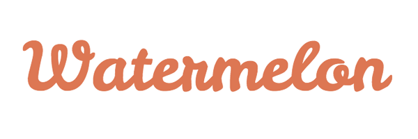

The above text starts 30px into the viewport of the SVG, and the bottom of the text is set 90px in from the top of this viewport: `x="30" y="90"`.

#### rotate

A rotation can be placed on the individual letters/symbols, and/or on the element as a whole.

A single value within the `rotate` attribute results in each glyph rotating at that value. A string of values can also be used to target and assign a different rotation value to each letter. If there are not enough values to match the number of letters, the last value sets the rotation for the remaining characters.

The text below has a rotation set on the entire graphic through the `transform` element, but also a value for each glyph: `rotate="20,0,5,30,10,50,5,10,65,5"`.

		<svg width="600" height="250">
    		<text x="30" y="80" fill="#ED6E46" font-size="100" rotate="20,0,5,30,10,50,5,10,65,5" transform="rotate(8)" font-family="'Leckerli One', cursive">Watermelon</text>
  		</svg>

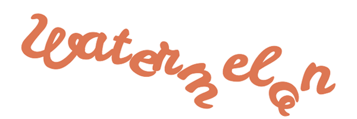

#### textLength & lengthAdjust

The `textLength` attribute specifies the length of the text. The length of the text will adjust to fit the length specified within this attribute by altering the space between the provided characters.

The following example has a `textLength` value of 900px. Notice that the spacing between the characters has increased to fill this space.

		<svg width="950" height="100">
    		<text x="30" y="90" fill="#ED6E46" font-size="100" textLength="900" font-family="'Leckerli One', cursive">Watermelon</text>
  		</svg>

When used in conjunction with the `lengthAdjust` attribute, it can be specified that both the letter spacing and glyph size should adjust to fit to these new length values.

A value of `"spacing"` results in an image that resembles the example above where the spacing between the characters has expanded to fill the space: ‘lengthAdjust=”spacing”’.

A value of `"spacingAndGlyphs"` directs both the spacing and the glyph size to adjust accordingly: `lengthAdjust="spacingAndGlyphs"`.

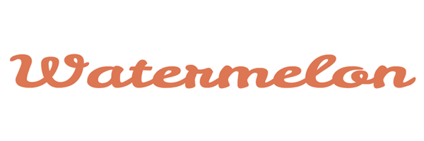

### The tspan Element

The `<tspan>` element is significant because SVG does not currently support automatic line breaks or word wrapping. `<tspan>` allows us to draw multiple lines of text by singling out certain words or characters to then be manipulated independently.

Instead of defining a new coordinate system for these additional lines, the `<tspan>` element positions these new lines of text in relation to the previous line of text.

The `<tspan>` element has no visual output on its own, but by specifying more details within the elements we can single out this particular text and have more control over its design and positioning.

In the example below "are" and "delicious" are located within separate `<tspan>` elements within the `<text>` element. By using `dy` within each of these spans, we are positioning the word along the y axis in relation to the word before it.

While "are" is positioned -30px from "Watermelons", "delicious" is positioned 50px from "are".

 		<svg width="775" height="500">
    		<text x="15" y="90" fill="#ED6E46" font-size="60" font-family="'Leckerli One', cursive"> Watermelons
      			<tspan dy="-30" fill="#bbc42a" font-size="80">are</tspan>
      			<tspan dy="50">delicious</tspan>
    		</text>
  		</svg>

You can also move each glyph individually through a list of values, as shown in the example below. The letter/symbol is then moved according to the position of the letter/symbol before it, and "delicious" is now positioned according to the "e" in "are".

The `tspan` containing “are” has the following list of `dy` values: `dy="-30 30 30"`.

### Spacing Properties

There are a number of properties available when using the `<text>` element within inline SVG that control the spacing of words and letters, similar to the capabilities of vector graphic software.

Understanding how to use these properties helps ensure graphics are displayed exactly as intended.

#### kerning & letter-spacing

Kerning refers to the process of adjusting the spacing between characters. The `kerning` property allows us to adjust this space based on the kerning tables that are included in the font being used, or set a unique length.

A value of `auto` indicates that the inter-glyph spacing should be based on the kerning tables that are included in the font being used.

The example below has a `kerning` value of `auto`, which in this instance has no visual impact since it is the default value.

		<svg width="420" height="200">
    		<text x="2" y="50%" fill="#ef9235" font-size="100" font-family="'Raleway', sans-serif" font-weight="bold" kerning="auto">Oranges</text>
  		</svg>

Adjusting the length between these characters can be done by simply including a numerical value: `kerning="30"`.

A value of `inherit` is also valid.

`letter-spacing` has value options of `normal`, `<length>`, or `inherit`. A numerical value here will have the same impact on the spacing as `kerning`. The `letter-spacing` property is intended to be used as supplemental spacing to any spacing already in effect from `kerning`.

#### word-spacing

Th `word-spacing` property specifies the spacing between words.

	<svg width="750" height="200">
    	<text x="2" y="50%" fill="#ef9235" font-size="70" font-family="'Raleway', sans-serif" word-spacing="30">Oranges are Orange</text>
  	</svg>

Other valid values here are `normal` (default), and `inherit`.

### text-decoration

The `text-decoration` property permits the use of `underline`, `overline`, and `line-through` in SVG text.

While drawing order does not always have an impact on visual output in SVG, the order does matter in regards to `text-decoration`.  All text decoration values, except `line-through`, should be drawn *before* the text is filled and/or stroked; this renders the text on top of the decorations.

`line-through` should be drawn after the text is filled and/or stroked, rendering the decoration on top of the text.

Here is a look at `text-decoration="underline"` and `text-decoration="line-through"`.

### text Along a Path

As mentioned, inline SVG provides us with advanced customization options that are similar to the capabilities of vector graphic software. Within the SVG code itself we can position text exactly as we want it to render on the screen.

In taking this manipulation even further, SVG `<text>` can be set to follow a given `<path>` element.

#### The textPath Element

The `textPath` element is where all the magic of this feature resides. While SVG text would generally reside within a `<text>` element, it will now reside within a `<textPath>` element within the `<text>` element.

This `<textPath>` will then call on the chosen path's `id` which is hanging out in a `<defs>` element waiting to be used.

The basic syntax:

	<svg>
    	<defs>
  			<path id="testPath" d="<....>"/>
  	    </defs>
       <text>
      		<textPath xlink:href="#testPath">Place text here</textPath>
       </text>
    </svg>

Here is a look at the vector path to be used in the code below:

After generating this path in vector graphic software the SVG *`<path>` element* code itself (which will not include color like shown above) can be copied and placed within the `<defs>` element in the `<svg>`, which is also shown in the code above.

	<svg width="620" height="200">
    	 <defs>
  			<path id="testPath" d="M3.858,58.607 c16.784-5.985,33.921-10.518,51.695-12.99c50.522-7.028,101.982,0.51,151.892,8.283c17.83,2.777,35.632,5.711,53.437,8.628 c51.69,8.469,103.241,11.438,155.3,3.794c53.714-7.887,106.383-20.968,159.374-32.228c11.166-2.373,27.644-7.155,39.231-4.449" />
  	     </defs>
     	 <text x="2" y="40%" fill="#765373" font-size="30" font-family="'Lato', sans-serif">
     		<textPath xlink:href="#testPath">There are over 8,000 grape varieties worldwide.</textPath>
     	 </text>
   	</svg>

##### xlink:href

The `xlink:href` attribute in a `<textPath>` allows us to reference the path to which the text will be rendered on.

##### startOffset

The `startOffset` attribute represents a text offset length from the start of the `path`. A value of "0%" indicates the start point of the `path`, while "100%" indicates the end point.

The example below has a `startOffset` of "20%" which pushes the text to begin 20% in along the path. The font size has been decreased to prevent it from rendering out of the viewport when moved.

Adding color to the path's stroke via the `<use>` element can aid in understanding what exactly is happening here.

		<svg width="620" height="200">
     		<defs>
  				<path id="testPath" d="M3.858,58.607 c16.784-5.985,33.921-10.518,51.695-12.99c50.522-7.028,101.982,0.51,151.892,8.283c17.83,2.777,35.632,5.711,53.437,8.628 c51.69,8.469,103.241,11.438,155.3,3.794c53.714-7.887,106.383-20.968,159.374-32.228c11.166-2.373,27.644-7.155,39.231-4.449" />
  			</defs>
    		<use xlink:href="#testPath" fill="none" stroke="#7aa20d" stroke-width="2"/>
    		<text x="2" y="40%" fill="#765373" font-size="20" font-family="'Lato', sans-serif">
      			<textPath xlink:href="#testPath" startOffset="20%">There are over 8,000 grape varieties worldwide.
      			</textPath>
    		</text>
  		</svg>

## Section 6. Advanced Features: Gradients, Patterns, Clipping Paths

### Gradients

There are two types of SVG gradients: linear and radial. Linear gradients are generated in a straight line, while radial gradients are circular.

A very simple linear gradient is structured like this:

	<svg>
    	<defs>
        	<linearGradient id="gradientName">
            	<stop offset="<%>" stop-color="<color>" />
            	<stop offset="<%>" stop-color="<color>" />
        	</linearGradient>
    	</defs>
	</svg>

The `<svg>` contains a `<defs>` element which allows us to create reusable definitions to be called on later. These definitions have no visual output until they are referenced using their unique ID within the stroke and/or fill attributes for SVG shapes or `<text>`. These shapes and/or text will also reside within the `<svg>` element, but outside of the `<defs>` element.

Once a gradient is built and assigned an ID, it can be called through the `fill` and/or `stroke` attributes within the SVG. For example, `fill= "url(#gradientName)"`.

#### Linear Gradients

Linear  gradients change color evenly along a straight line and each point (stop) defined on this line will represent the correlating color within the `<linearGradient>` element. At each point the color is at 100% saturation, and the space in between expresses a transition from one color to the next.

##### stop Nodes

`<stop>` nodes can also accept an opacity with `stop-opacity="<value>"`

Below is the code for a simple linear gradient with two color stops applied to a rectangle:

		<svg width="405" height="105">
    		<defs>
      			<linearGradient id="Gradient1" x1="0" y1="0" x2="100%" y2="0">
        			<stop offset="0%" stop-color="#BBC42A" />
        			<stop offset="100%" stop-color="#ED6E46" />
      			</linearGradient>
    		</defs>
    		<rect x="2" y="2" width="400" height="100" fill= "url(#Gradient1)" stroke="#333333" stroke-width="4px" />
  		</svg>

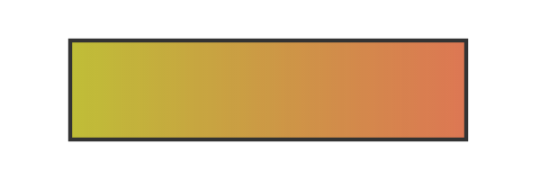

`offset` informs the gradient at what point to assign the correlating `stop-color`.

##### x1, y1, x2, y2

The x1, y1, x2, and y2 attribute values represent the start and end points onto which the gradient stops (color changes) are mapped. These percentages will map the gradients respectively along the appropriate axis.

A `y` value of “100%” and an `x` value of “0” will produce a horizontal gradient, while the reverse will produce a vertical one. Having both values set at “100%” (or any value outside of 0) will render an angled gradient.

##### gradientUnits

The `gradientUnits` attribute defines the coordinate system for the x1, x2, y1, y2 values. The two value options here are ‘userSpaceOnUse’ or ‘objectBoundingBox’. `userSpaceOnUse` sets the gradient coordinating system in absolute units, while `objectBoundingBox` (default) establishes this system within the bounds of the SVG shape itself, the target.

##### spreadMethod

The `spreadMethod` attribute’s value specifies how the gradient will spread out through the shape if it starts or ends inside the bounds of the target. If the gradient is set to not fill the shape, `spreadMethod` determines how the gradient should go about covering that empty space. There are three options here: ‘pad’, ‘repeat’, or ‘reflect’.

A value of `pad` (default) directs the first and last colors of the gradient to spread out over the remainder of the uncovered target region. A value of `repeat` directs the gradient to repeat the pattern from the beginning continuously. A value of `reflect` will reflect the gradient pattern alternating from start-to-end, end-to-start continuously.

The start and end point for the gradient below is: x1="20%" y1="30%" x2="40%" y2="80%".

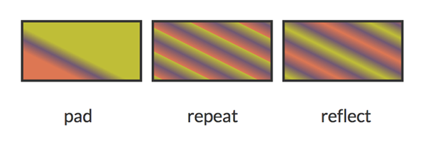

##### gradientTransform

The `gradientTransform` attribute is optional and allows for further transformation of the gradient before it is mapped, like adding a rotation.

##### xlink:href

The `xlink:href` attribute allows you to call on the ID of another gradient to inherit its details, but you can also include different values.

		<linearGradient id="repeat" xlink:href="#Gradient-1” spreadMethod="repeat" />

This gradient inherits the details of the first gradient from the beginning of this section, but has an alternate spreadMethod value.

#### Radial Gradients

Most of the attributes for a `<radialGradient>` are the same as those of `<linearGradient>` except there is a different set of coordinates to work with.

##### cx, cy, r

The `cx`, `cy`, and `r` attributes define the outermost section of the circle and the 100% `stop-color` of the gradient will be mapped to the perimeter of this value. `cx` and `cy` define the center coordinate, while `r` sets the radius of the gradient.

##### fx, fy

The `fx`, `fy` attributes represent the coordinates for the gradient’s focal point, or innermost circle. Essentially, the center of the gradient does not have to also be its focal point, which can be altered with these values.

While by default the focal point of the radial gradient would be centered, the focal point attributes can change this. The focal point values for the image below are `fx="95%" fy="70%"`.

		<svg width="850px" height="300px">
    		<defs>
      			<radialGradient id="Gradient2" cy="60%" fx="95%" fy="70%" r="2">
        			<stop offset="0%" stop-color="#ED6E46" />
        			<stop offset="10%" stop-color="#b4c63b" />
        			<stop offset="20%" stop-color="#ef5b2b" />
        			<stop offset="30%" stop-color="#503969" />
        			<stop offset="40%" stop-color="#ab6294" />
        			<stop offset="50%" stop-color="#1cb98f" />
        			<stop offset="60%" stop-color="#48afc1" />
        			<stop offset="70%" stop-color="#b4c63b" />
        			<stop offset="80%" stop-color="#ef5b2b" />
        			<stop offset="90%" stop-color="#503969" />
        			<stop offset="100%" stop-color="#ab6294" />
      			</radialGradient>
    		</defs>
    		<text x="20%" y="75%" fill= "url(#Gradient2)" font-family= "'Signika', sans-serif" font-size="200">Cherry</text>
  		</svg>

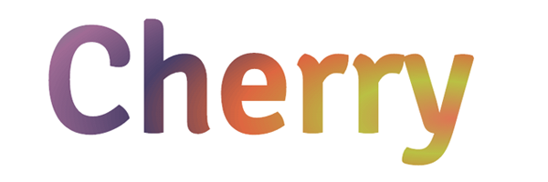

In this example, the focal point shifts to the bottom right of the image.

### Patterns

Patterns are generally considered one of the more complex paint options available to color the fills and strokes of SVG. Establishing a foundation and understanding the basic syntax can make these seemingly more complex patterns much more obtainable.

Here is a look at the syntax for a basic pattern applied to a rectangle:

		<svg width="220" height="220">
    		<defs>
      			<pattern id="basicPattern" x="10" y="10" width="40" height="40" 								patternUnits="userSpaceOnUse">
       				<circle cx="20" cy="20" r="20" fill= "#BBC42A" />
    			</pattern>
  			</defs>
  			<rect x="10" y="10" width="200" height="200"
      		stroke="#333333" stroke-width="2px" fill="url(#basicPattern)" />
  		</svg>

#### Basic Attributes

The attributes and values for patterns define the "canvas", the design, and overall positioning. Patterns can consist of paths and/or shapes, can paint text, and can even be nested within another pattern.

##### x, y, width, height

The x and y attributes within the `<pattern>` element define how far into the shape the pattern will start. Width and height used within the `<pattern>` element define the actual width and height of the allotted pattern space.

The “basicPattern” referenced above contains the following values: `x="10" y="10" width="40" height="40"`. The pattern will start 10px in from the start of the x axis, 10px in from the start of the y axis, and essentially create a “canvas” that is 40px wide, and 40px high.

##### patternUnits

The `patternUnits` attribute defines the coordinates for which x, y, width, and height are referenced. The two options here are `userSpaceOnUse` and `objectBoundingBox` (default).

`userSpaceOnUse` results in a pattern coordinate system that is determined by the coordinate system for the element referencing the `<pattern>`, while `objectBoundingBox` establishes the mapping coordinate system as the bounding box of the element to which the pattern is applied.

##### patternContentUnits

The `patternContentUnits` attribute values are the same as the values for `patternUnits`, except the coordinate system is now being defined for the contents of the pattern itself.

This value, unlike `patternUnits`, defaults to `userSpaceOnUse`, which means that unless one or both of these attributes are specified the shapes drawn within the `<pattern>` are being drawn in  a different coordinate system than the `<pattern>` element is using.

Defining `patternUnits="userSpaceOnUse"` within the `<pattern>` element simplifies this process and ensures a consistent workspace.

#### Nested Patterns

Patterns can also be nested to create a much more unique and detailed design.

Here is a look at the structure of a basic nested pattern:

	<svg width="204" height="204">
  		<defs>
    		<pattern id="circlePattern"
             x="4" y="4" width="75" height="75"
             patternUnits="userSpaceOnUse">
      			<circle cx="12" cy="12" r="8"
            stroke="#ed6e46" stroke-width="3" fill="#765373" />
    		</pattern>
			<pattern id="rectPattern"
             x="10" y="10" width="50" height="50"
             patternUnits="userSpaceOnUse">
      			<rect x="2" y="2" width="30" height="30"
              stroke="#bbc42a" stroke-width="3" fill="url(#circlePattern)" />
    		</pattern>
  		</defs>
  		<rect x="2" y="2" width="200" height="200"
      stroke="#333333" stroke-width="3" fill="url(#rectPattern)" />
	</svg>

The `<defs>` element contains both patterns. Within `<defs>`, the pattern for the rectangle is calling on the circle pattern via `fill` and the main rectangle is then calling on the rectangle pattern also via `fill`, painting the interior of the main shape with a nested pattern.

### Clipping Path

The clipping path restricts the region to which paint will be applied to the SVG. Any region drawn outside of the bounds set by the clipping path will not be rendered.

To demonstrate the abilities of this feature, let's use a clipping path consisting of "Apples" text being applied over a tomato colored rectangle and a green circle.

Below are the shapes without the clipping path applied, set to stretch beyond the viewport.

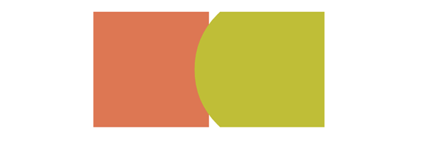

Now, here's a look at the code to apply the "Apples" text to this "canvas".

 	<svg width="400px" height="200px">
    	<clipPath id="clip-text">
      		<text x="0" y="50%" fill="#f27678" font-size="120px" font-family=" 'Signika', sans-serif">Apples</text>
    	</clipPath>
    	<rect x="0" y="0" width="200" height="200" fill="#ed6e46" clip-path="url(#clip-text)" />
    	<circle cx="310" cy="100" r="135" fill="#bbc42a" clip-path="url(#clip-text)" />
  	</svg>

The clipping path is defined within the `<clipPath>` element and then called on by both shapes by referencing its unique `id`.

## Conclusion

Writing inline SVG enables very useful editing powers and lets us as the author have complete access to all the graphical elements individually. Within this code we are generating graphics that scale without losing image quality, are searchable, and enhance accessibility.

It will most likely take some time tinkering to get comfortable with your SVG writing abilities, but once you do I would recommend working on making your code as short and efficient as possible, exploring [SMIL animations](http://www.w3.org/TR/smil-animation/), and experimenting with [styling SVG elements with CSS](https://developer.mozilla.org/en-US/docs/Web/Guide/CSS/Getting_started/SVG_and_CSS).

Hopefully this guide acts as both a valuable reference, and an inspiration in terms of understanding the powerful potential of building and manipulating inline SVG.

For news and updates, please visit [the book's site](http://svgpocketguide.com/), and if you have any questions or comments in regards to the book I can be reached [on Twitter](https://twitter.com/JoniTrythall) or by email at [info@jonibologna.com](mailto:info@jonibologna.com).

